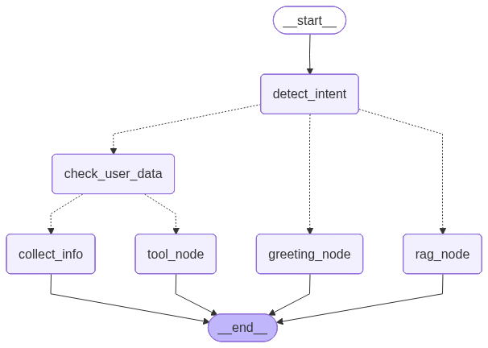

# Social-to-Lead Agentic Workflow (AutoStream AI Agent)

## Short Description
A stateful conversational AI agent that transforms user interactions into qualified leads using LangGraph, RAG, and tool execution.

## Tech Stack
* Python 3.11
* LangGraph + LangChain
* Groq (LLM)
* HuggingFace Embeddings (all-MiniLM-L6-v2)
* FAISS (vector store)
* uv (package manager)

## Project Description
This project implements a conversational AI agent for a fictional SaaS product "AutoStream". 

The agent performs:
1. Intent Detection (Greeting, Product Query, High Intent)
2. RAG-based knowledge retrieval from a local knowledge base
3. Multi-turn stateful conversation using LangGraph
4. Step-by-step lead information collection
5. Tool execution via mock_lead_capture() after collecting all details

## Workflow
* User asks a question -> agent answers using RAG
* User shows interest -> agent detects high intent
* Agent collects:
  * Name
  * Email
  * Platform
* After collecting all details -> calls mock API

## Knowledge Base
Stored locally and includes:
* Pricing:
  * Basic Plan: $29/month, 10 videos, 720p
  * Pro Plan: $79/month, unlimited videos, 4K, AI captions
* Policies:
  * No refunds after 7 days
  * 24/7 support only on Pro plan

## Project Structure
```text
agent/
  graph.py
  intent.py
  rag.py
  state.py
  tools.py

asset/
  workflow.png

data/
  knowledge.json

.env.example
.gitignore
main.py
pyproject.toml
requirements.txt
uv.lock
README.md
```

## Workflow Graph


The flow of the LangGraph nodes:

START -> detect_intent
-> greeting_node (if greeting)
-> rag_node (if product query)
-> check_user_data (if high intent)

check_user_data
-> collect_info (if data missing)
-> tool_node (if all data collected)

collect_info -> END
tool_node -> END

This graph ensures proper routing through conditional edges. By evaluating the session state at `check_user_data`, the architecture prevents premature tool calls until all required properties (name, email, platform) are present. The flow terminates at `END` during `collect_info`, naturally passing control back to the user to pause and capture responses natively over a multi-turn conversation.

## Installation

```bash
uv pip install -r requirements.txt
```

## Running the Application

```bash
uv run python main.py
```

## Architecture Explanation
The application relies heavily on LangGraph to manage cyclic, multi-turn stateful workflows, resolving the limitations of linear conversational chains. LangGraph allows the agent to iteratively loop through human-in-the-loop interactions without losing context or dropping entity data gathered in preceding steps.

State is safely managed across conversational turns via an overarching State Dictionary. Variables such as `intent`, `is_high_intent`, and `user_data` natively persist across nodes. Because `is_high_intent` locks in a True value upon classification, the system avoids redundant context gathering and focuses strictly on information capture.

The architecture elegantly links intent detection, RAG retrieval, and tool execution as independent nodes governed by LangGraph edges. Incoming queries initially hit the intent detection node utilizing Groq's Large Language Models to classify interaction structure. Routine inquiries branch off to the RAG node where FAISS and HuggingFace fetch localized policies and gracefully exit. Deep-intent patterns are shifted to a dedicated collection boundary that seamlessly intercepts conversations to aggregate data before dispatching the final lead payload APIs securely.

## WhatsApp Integration
This agent can be integrated directly utilizing WhatsApp Webhooks through services such as the Twilio API or Meta Business API. 

The integration flow:
* A webhook receives incoming messages from the messaging provider.
* The message is directed to the LangGraph agent, properly mapping the phone number as the unique thread/session identifier for state persistence.
* The agent processes the input, navigates the relevant nodes, and resolves its logic.
* The generated response is passed natively back via API payload to the user's mobile device.
